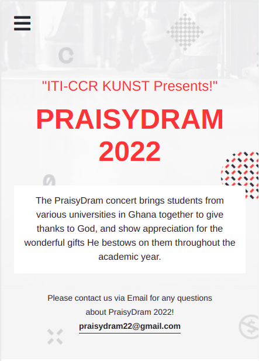
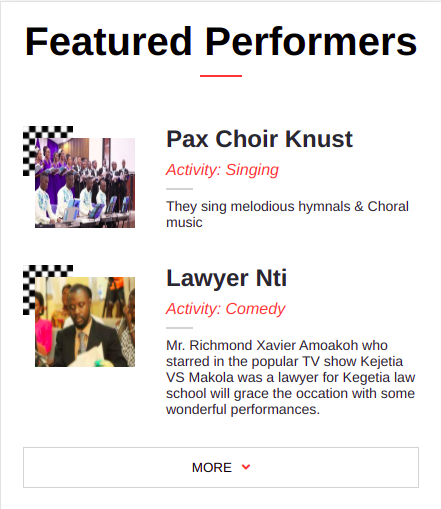

# HTML-CSS-JavaScript-capstone-project

> This is my first capstone project on HTML + CSS + JAVASCRIPT. It is based on a yearly concert of Praises and Drama aimed at    Evangelising to the people of God. It is organised by Catholic students in KNUST and it's popularly known as PRAISYDRAM.

> Below is the various section views for the website.

Mobile Homepage view                              |  Mobile Main program view                             |
:------------------------------------------------:|:-----------------------------------------------:
    |  

Mobile About view                                 |  Mobile Featured Performers view                             |
:------------------------------------------------:|:-----------------------------------------------:
    |  

Desktop Homepage View                             |  Desktop About view
:------------------------------------------------:|:-----------------------------------------------:
     |  

## Built With

- HTML
- CSS
- Javascript

## Link to project online
- [OnlineVersion](https://achilles-dev.github.io/HTML-CSS-JavaScript-capstone-project/)

## Link to project recorded video
- [Live Recording](https://www.loom.com/share/a80b0f830ee0431c961e774e71b31efe)


## Getting Started


To get a local copy up and running follow these simple example steps.

### Prerequisites

### Setup

1. Clone Repository 
   ```
   git clone git@github.com:Achilles-Dev/HTML-CSS-JavaScript-capstone-project.git
   ```

### Install

1. Run
   ```
   npm install --save-dev hint@6.x
   ```
2. Run
   ```
   npm install --save-dev stylelint@13.x stylelint-scss@3.x stylelint-config-standard@21.x stylelint-csstree-validator@1.x
   ```
3. Run
   ```
   npm install --save-dev eslint@7.x eslint-config-airbnb-base@14.x eslint-plugin-import@2.x babel-eslint@10.x
   ```
### Link to Online Version

   [PraisyDram 2022](https://github.com/Achilles-Dev/HTML-CSS-JavaScript-capstone-project) 

## Author

👤 **Solomon Hagan**

- GitHub: [@Achilles-Dev](https://github.com/Achilles-Dev/)
- Twitter: [@SoloAchilles](https://twitter.com/SoloAchilles/)
- LinkedIn: [Solomon Hagan](https://www.linkedin.com/in/solomon-hagan-b51693138/)


## 🤝 Contributing

Contributions, issues, and feature requests are welcome!

Feel free to check the [issues page](../../issues/).

## Show your support

Give a ⭐️ if you like this project!

## Acknowledgments

- README template from [Microverse](https://github.com/microverseinc/readme-template)
- Linter setup from [Microverse](https://github.com/microverseinc/linters-config/tree/master/html-css)
- Based on this [beautiful design](<https://www.behance.net/gallery/29845175/CC-Global-Summit-2015>) by [Cindy Shin](<https://www.behance.net/adagio07>). Here is the [Creative Commons License of the design](<https://creativecommons.org/licenses/by-nc/4.0/>). 

## 📝 License

This project is **[MIT](./LICENSE.md)** licensed.
